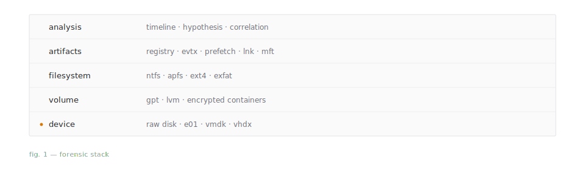

<picture>
  <source media="(prefers-color-scheme: dark)" srcset="banner-dark.svg">
  
</picture>

---

## About

I work in digital forensics — the byte-level view. How filesystems lay out
their records, how Windows scatters application state across dozens of
artifacts, how browsers persist traces in SQLite.

Mostly Rust these days. Occasional Python, TypeScript. I prefer the end of
the stack where decisions are irreversible.

## Areas

<picture>
  <source media="(prefers-color-scheme: dark)" srcset="stack-dark.svg">
  
</picture>

## Contact

`sisyphus9402@gmail.com`
